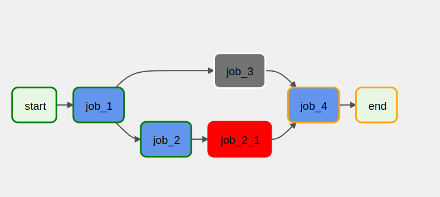

### A case of working with Airflow as an ETL tool
The case is as follows:
1. Each dag is a separate data flow for processing and loading data
2. Each flow consists of a set of jobs
3. Job is a set of atomic tasks presented as a TaskGroup in terms of Airflow
4. Each flow consists of two parts: a program part (the code of the dag itself) and a descriptive part (*.yml), which contains the parameters of the dag and registers its jobs
4. Each job also consists of two parts: a program part (a set of tasks) and a descriptive part (*.yml), which contains job parameters and specifies dependencies with other jobs.

The advantages of this approach are the ease of creating jobs as an elementary unit of dag from atomic tasks, registering new jobs in the dag configuration file without having to change the code. 

##### Example of the dag:


1. Example of the dag's descriptive part:
```yml
dag_id: FLOW_1
schedule: "@once"
tags: ['test', 'e.g.']
jobs:
  - job_name: JOB_1
    job_type: dbt.dbt_model
    enable: True
    project: ../dbt/example_project
    profile:
      conn_type: postgres
      dbt_conn_id: postgres_conn
      target: postgres
      schema: public
    select: [+customers]

  - job_name: JOB_2
    job_type: dummy
    enable: False
    depends_on: [JOB_1]
```

##### Features:
1. Enabling/disabling a job
2. If a job contains some python error, it won't affect the whole dag - job will become red and disabled.

_red job - task group with error inside, grey job - disabled_



