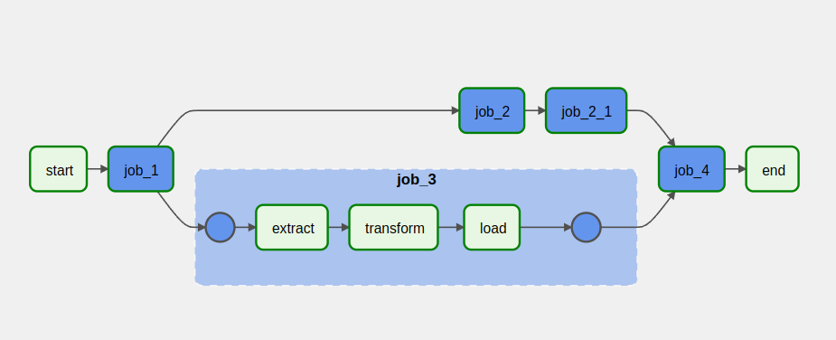

### Набросок self-serfice дагогенератора для Airflow
На основе входящих простых yaml-файлов генератор формирует даги со сложными зависимостями внутри себя, позволяя реализовать логику, состояющую из различного рода преопределенных "джобов":
1. Пример yaml-файла для генерации:
```yml
dag_id: FLOW_1
schedule: "@once"
tags: ['test', 'e.g.']
jobs:
  - job_name: JOB_1
    job_type: dbt.dbt_model
    enable: True
    project: ../dbt/example_project
    profile:
      conn_type: postgres
      dbt_conn_id: postgres_conn
      target: postgres
      schema: public
    select: [+customers]

  - job_name: JOB_2
    job_type: dummy
    enable: False
    depends_on: [JOB_1]
```
##### Пример дага:


##### Возможности генератора:
1. Включение/выключение части дага (отдельных джобов)
2. Внедрение в даг джоба, содержащего синтаксические ошибки не приводит к падению дага - лишь к выключения джоба

_red job - task group with error inside, grey job - disabled_


Плюсы подхода:
- Упрощение написания ETL-процессов для не дата-инженеров
- Отделение бизнес-логики от программной реализации
- Скоращение числа ошибок при формироваии дага
- ...
